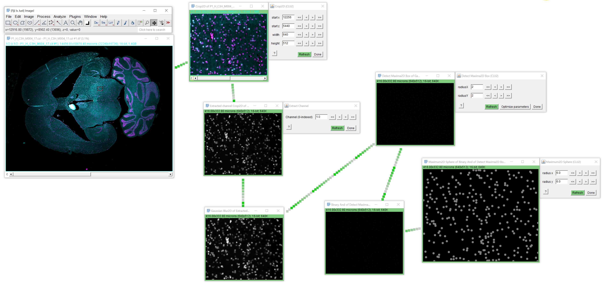
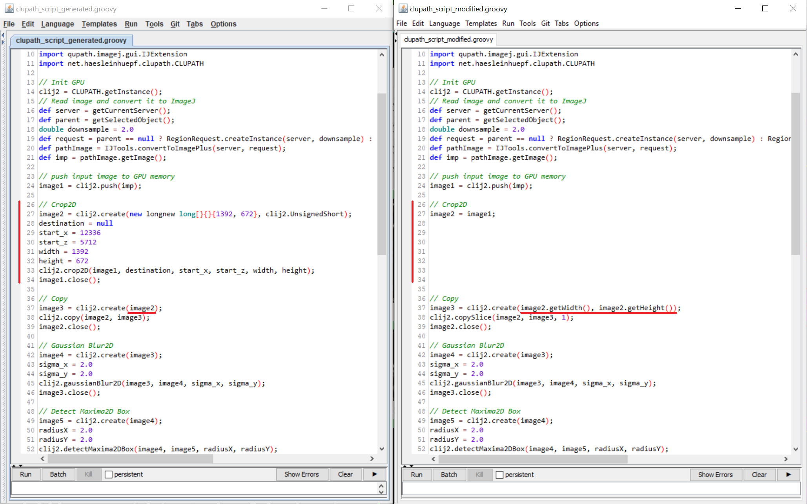
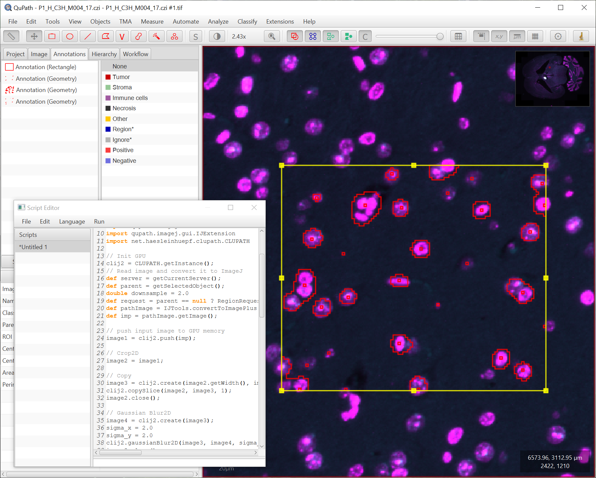

## Cell Detection in QuPath with CluPath

Setup a workflow for detecting nuclei in  `P1_H_C3H_M004_17.czi - P1_H_C3H_M004_17.czi #1.tif` (available [online](https://zenodo.org/record/4276076#.X7_7cM1KguU), courtesy of Theresa Suckert, OncoRay, University Hospital Carl Gustav Carus, TU Dresden, license CC-BY 4.0)

Use operations such as
* Crop 2D
* Extract Channel
* Detect Maxima 2D?
* Threshold Otsu 2D?
* Binary Weka Pixel Classifier?

Export a Groovy script for QuPath using CluPath. You have to edit this script to make it work in QuPath: 
You need to remove the crop-step as cropping is done by QuPath. 
Replace the copy step by a copy slice step to extract a slice in QuPath, which correspond to the channel.

Before opening the Groovy script in QuPath, check that [CluPath is installed](https://github.com/clij/clupath).

