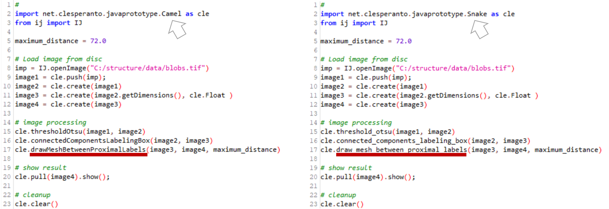
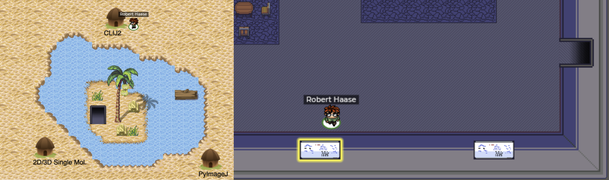

# CamelCase or snake_case?

Try out Camel and Snake case in clEsperantoJ in Fiji Jython.

Afterwards, go to the I2K2020 virtual meeting at gather.town and make a cross at the poll white board in the CLIJ2 hut.

