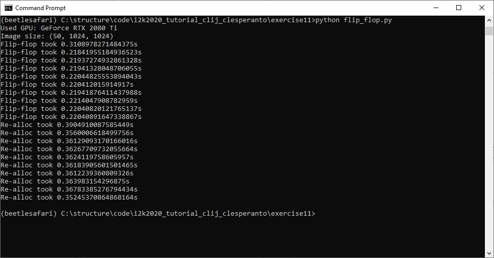

# Reuse versus reallocation of memory

Write a script which contains two for-loops which execute the same operation, but once with reusing memory (not releasing/closing)
and once with re-allocating memory. Print out how long processing takes.

## Hints (python)

Reusing memory:
```
for i in range(0, num_iterations):
    cle.maximum_sphere(flip, flop, 10, 10, 0)
    cle.minimum_sphere(flop, flip, 10, 10, 0)
```

Allocating new images in every loop:
```
for i in range(0, num_iterations):
    flop = cle.maximum_sphere(flip, radius_x=10, radius_y=10, radius_z=0)
    flip = cle.minimum_sphere(flop, radius_x=10, radius_y=10, radius_z=0)
```

