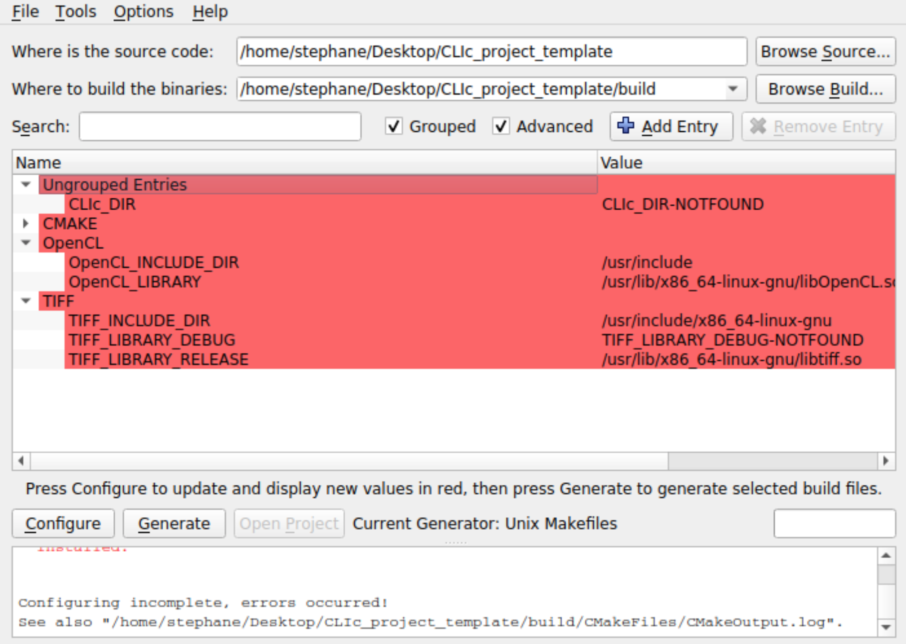

# Compile and run a CLIc script

Up for a more complex challenge?

Download both the [CLIc Library](https://github.com/clEsperanto/CLIc_prototype) and the [CLIc template project](https://github.com/StRigaud/CLIc_project_template). 
And compile the CLIc template project using CMake.
Then modify the project to apply a 2D Gaussian Blur operation to an image.

## Hints

[Guideline](https://github.com/clEsperanto/CLIc_prototype/blob/master/docs/clic_compile_guide.md) and [Troubleshooting](https://github.com/clEsperanto/CLIc_prototype/blob/master/docs/clic_prerequish_install.md) can be found in the CLIc project documentation.

The current CLIc template project executable is configured to take an input .tif filename and an output .tif filename as parameters.

   
(CLIc library is not found, help CMake find it!)