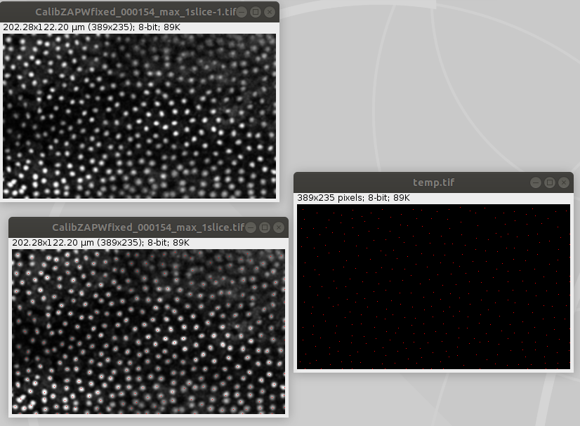

# Count nuclei with CLIc

Why make it simple when you can make it complicate!  

Re-using the CLIc project from Exercise 12, setup a workflow to count the number of nuclei in the image [CalibZAPWfixed_000154_max.tif](https://github.com/clEsperanto/i2k2020_tutorial_clij_clesperanto/blob/master/exercise12/CalibZAPWfixed_000154_max_1slice.tif)

## Hints
- Summing pixels is the way of counting  
- You can use the CLIjx-assistant to help you defining the pipeline
- we should be arround 363