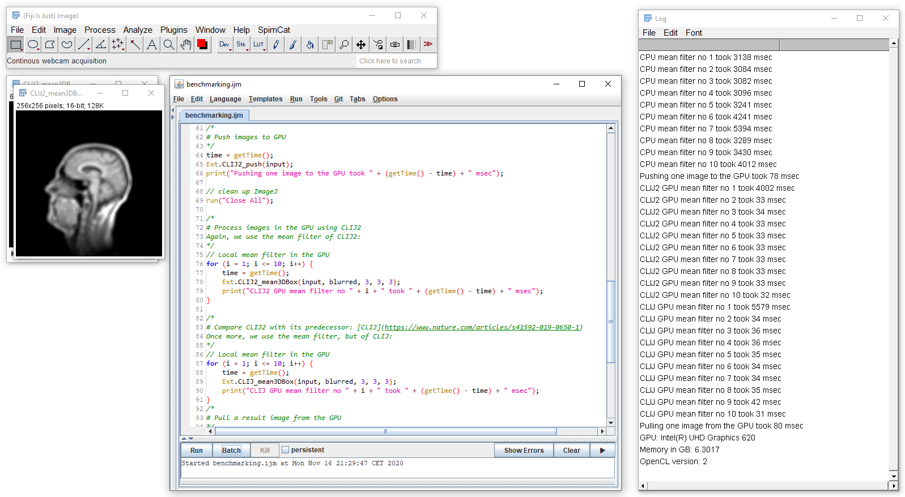

# Exercise 1: Basic benchmarking
Navigate to the [CLIJ website](https://clij.github.io). 
If not done yet, follow the [installation instructions for Fiji](https://clij.github.io/clij2-docs/installationInFiji)

Starting from the CLIJ home page, locate the code examples in the ImageJ Macro language. 

Open `benchmarking.ijm` in Fiji and execute it.

How much time does a Mean3D filter take on your CPU and on your GPU? What's the speedup ratio for your system?

