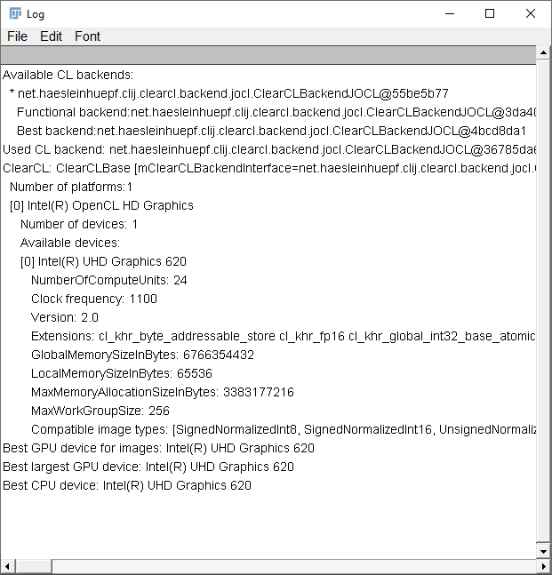

# Exercise 2: Study your GPUs

Execute `clinfo.ijm` from [here](https://github.com/clij/clij2-docs/blob/master/src/main/macro/clInfo.ijm). 
It will print out information about installed GPU devices.

From this log answer these questions
* What GPU is used per default?
* Home much memory does it have available?
* How large can a single image be when being processed in the GPU?
* Assume your image stack is 1024x1024 pixels large and of type 32-bit float, how many planes can it have so that it still fits in GPU memory?
