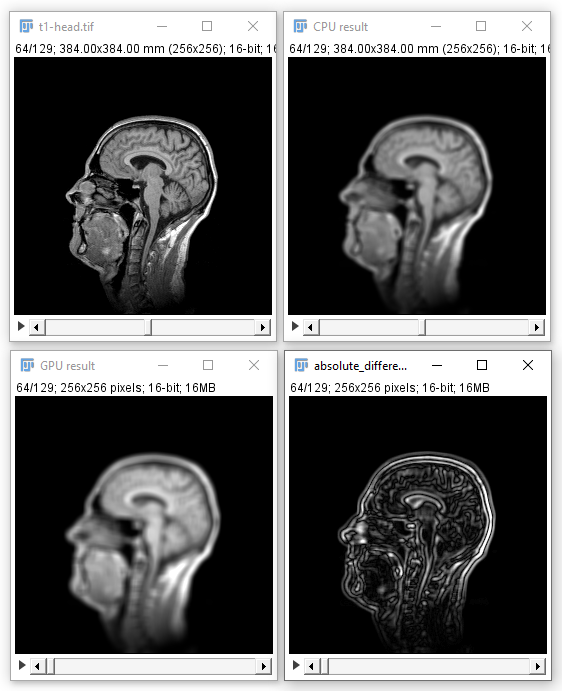

# Quantitative comparison

Compare the mean filters in ImageJ and CLIJ when processing the `t1-head` example dataset.
Compute an image showing the difference or the absolute difference between both results.
Try [mean3DBox](https://clij.github.io/clij2-docs/reference_mean3DBox) and [mean3DSphere](https://clij.github.io/clij2-docs/reference_mean3DSphere). 
Which one is closer to ImageJ's 'Mean 3D' filter?

Also run [mean_detailed_comparison_IJ_CLIJ.ijm](https://github.com/clij/clij2-docs/blob/master/src/main/macro/mean_detailed_comparison_IJ_CLIJ.ijm).
What can you learn from it?