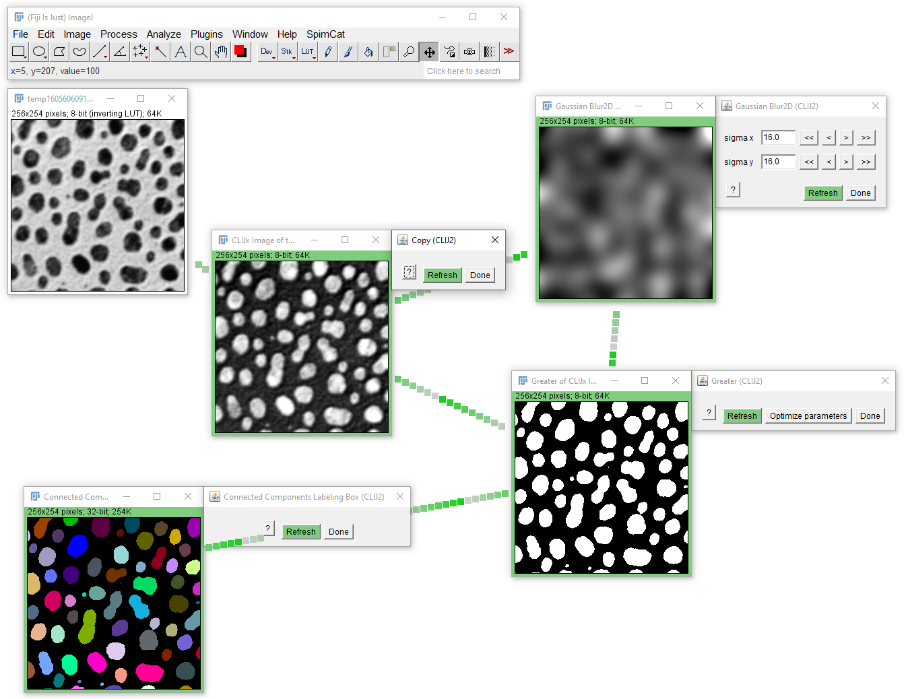
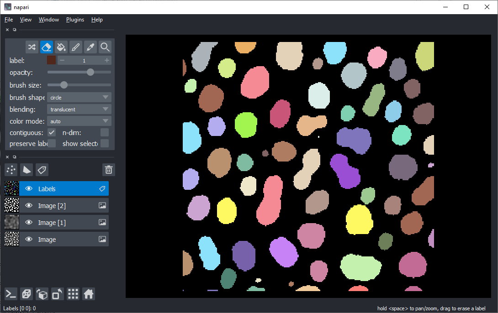

# Exercise 5: Interactive workflow design

Setup a workflow for counting blobs in ImageJ's blobs.gif example image using the interactive workflow design tool. 
Use CLIJ2 functions only, for example:
* Gaussian Blur
* Greater
* Connected Component Labeling

Export the workflow as ImageJ Macro script for and Fiji Jython.

Optional: Export the workflow as Icy Javascript, as Icy protocol and for QuPath as groovy script. 
Feel free to generate a Fiji plugin.

Furthermore, if you only used operations, which are "py" compatbile, export a clEsperanto-based Jupyter notebook and a Python script that uses Napari.

