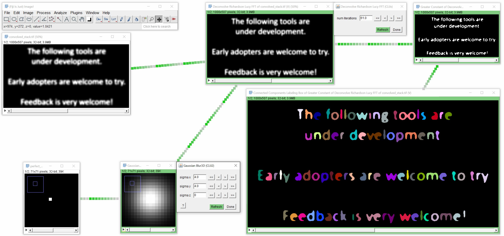

# Exercise 6: Deconvolution + Segmentation

Setup a workflow for deconvolving and segmenting letters in [convolved_stack.tif](convolved_stack.tif)

Export the workflow as IDFG-groovy file for reoloading, as ImaeJ Macro, and optional as ImageJ Macro Markdown Notebook and PDF.
