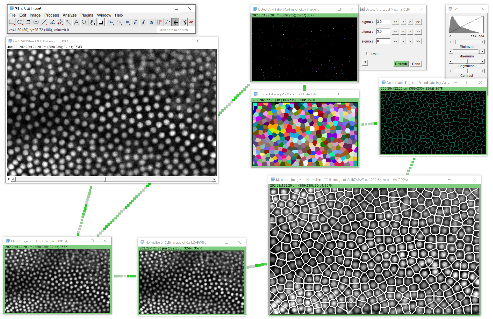

# Exercise 7: Segmentation in time lapse data

Setup a workflow for estimating cell borders between nuclei in [CalibZAPWfixed_000154_max.tif](CalibZAPWfixed_000154_max.tif)

Export an ImageJ Macro and run it. 

Note: This exercise will teach you how to deal with errors in generated macro code and how to 
build in a for loop to process frames individually.

Hints:
* [create3D](https://clij.github.io/clij2-docs/reference_create3D)
* `Stack.setFrame(frame + 1);`
* [pushCurrentSlice](https://clij.github.io/clij2-docs/reference_pushCurrentSlice)

