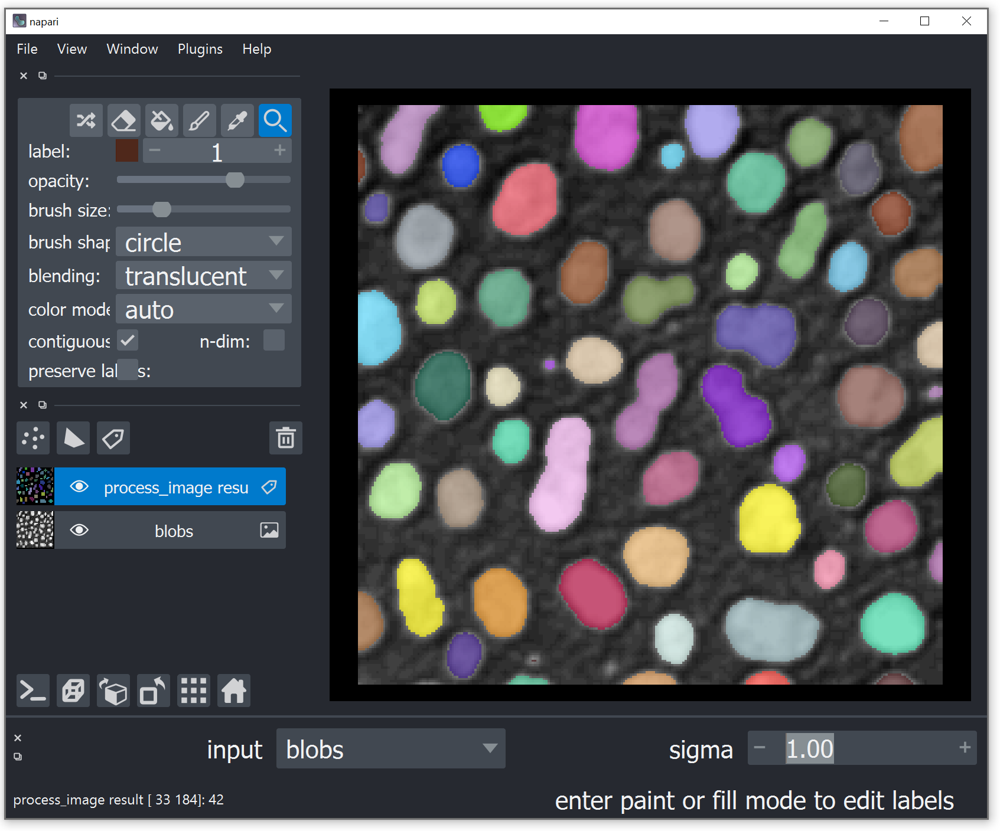

## clEsperanto + napari + magicgui

After [installing python](https://clij.github.io/assistant/installation#te_oki), also install [magicgui](https://magicgui.readthedocs.io/en/latest/):
```
pip install magicgui
```

Check out the minimal [napari example](https://github.com/clEsperanto/pyclesperanto_prototype/blob/master/demo/napari_gui/napari_.py) 
and the [reference of pycleasperanto](https://clij.github.io/clij2-docs/reference__pyclesperanto). 

Write an interactive user interface for changing parameters while segmenting / labeling blobs.



Hint: Start your pthon script with:
```
ipython --gui=qt napari_magicgui.py
```