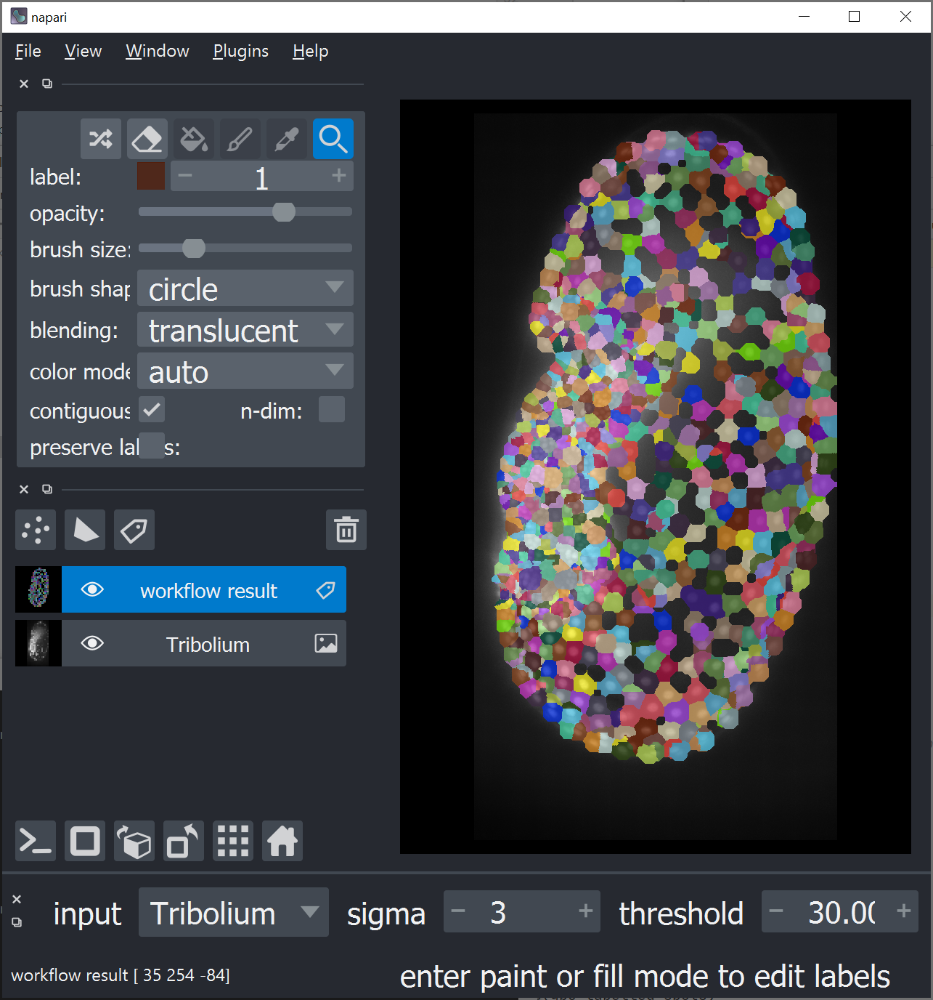

## Tribolium morphometry in Python

Use the dataset `Lund_18.0_22.0_Hours.tif` [from the tribolium_surface_removal.zip](https://zenodo.org/record/4276076#.X8QJWc1KguV) (Courtesy of Daniela Vorkel, Myers lab, MPI CBG) 
and segment the cells. Hint: Check out the [ImageJ macro counter part workflow](https://clij.github.io/clij2-docs/md/tribolium_morphometry/)

Make use of napari and magicgui to tune the parameters of the workflow!

Note: For this exercise you might need a powerful GPU.

